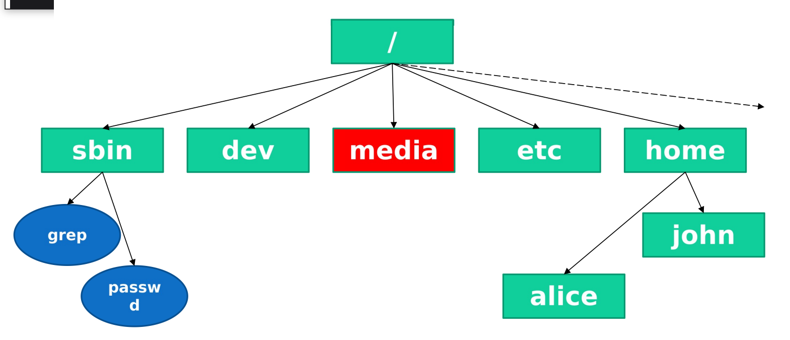
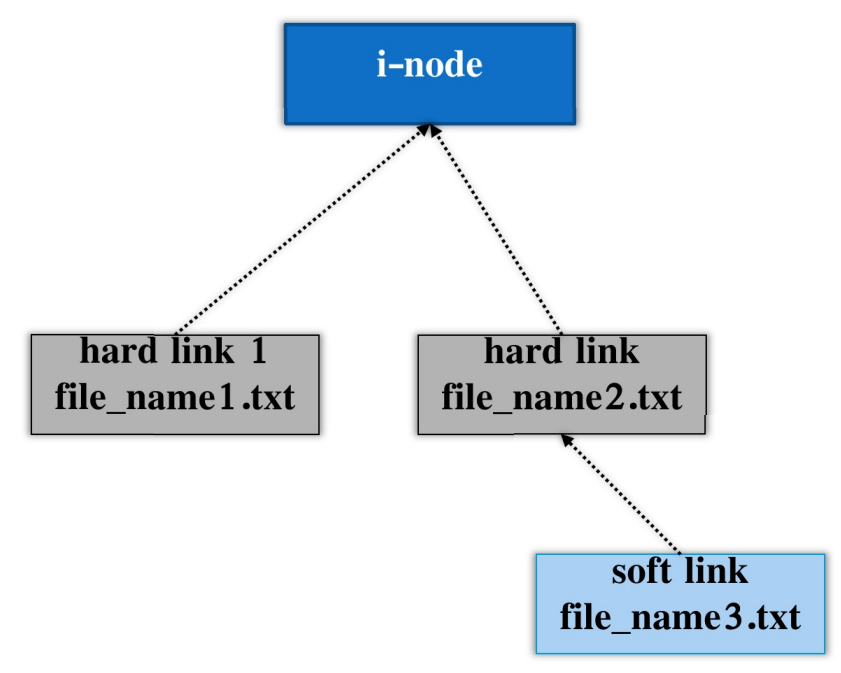
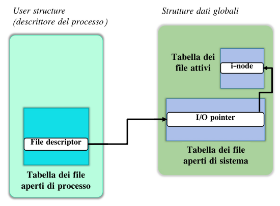
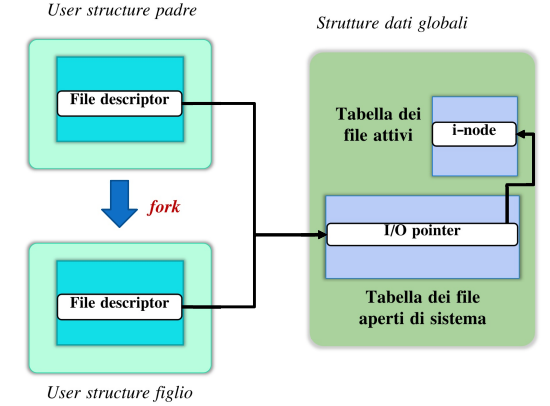

# 1. Indice

- [1. Indice](#1-indice)
- [2. Filesystem UNIX](#2-filesystem-unix)
	- [2.1. Gestione dei File](#21-gestione-dei-file)
	- [2.2. Accesso ai File](#22-accesso-ai-file)
	- [2.3. Comunicazione tra processi - `pipe`](#23-comunicazione-tra-processi---pipe)
- [3. Pilotare Applicazioni](#3-pilotare-applicazioni)

# 2. Filesystem UNIX

Tutti i dischi e le relative partizioni vengono rese accessibili mediante un unico _filesystem virtuale_ attraverso le operazioni di **_mounting_** (_montaggio_).



All'interno del _virtual filesystem_ `UNIX` vi sono alcune cartelle principali sempre presenti:
- `/`: è la _root_ del filesystem
- `/home`: contiene le _home directory_ degli utenti del sistema
- `/sbin`: contiene i programmi del sistema
- `/etc`: contiene i file di configurazione
- `/dev`: rende accessibili le periferiche
- `/media`: rende accessibili i supporti removibili

Il comando per rendere accessibile un filesystem in una determinata posizione del _virtual filesystem_ è `mount`:
```bash
sudo mount /dev/sdb1 /mnt/usb			# Rende accessibile il contenuto della partizione /dev/sdb1 nella cartella /mnt/usb
sudo umount /mnt/usb					# Scollega il dispositivo

mount -t vfat /dev/sdb1 /mnt
```

Il file di configurazione con le informazioni relative al montaggio di _filesystem_ all'avvio è `/etc/fstab`.

## 2.1. Gestione dei File

I sistemi `UNIX` sono caratterizzati dall'omogeneità della rappresentazione delle risorse, tutte trattate come **file**.

I file sono di tre tipi:
- **Ordinario**: insieme di informazioni allocate nella memoria di massa
- **Speciale**: dispositivo fisico
- **Directory**: insieme di file

In particolare i **directory file** sono costituiti da una serie di _record_ che ne descrivono il contenuto:
```file
<nome_file1, i-number1>
<nome_file2, i-number2>
<nome_file3, i-number3>
...
```

Una parte del disco è dedicata alla `i-List`, ovvero la **_lista di tutti i descrittori di file_**, detti `i-node`, riferiti e identificati da un `i-number`.

L'`i-node` descrive le caratteristiche del file:
- **Tipo**: ordinatrio, speciale, directory
- **Info sui permessi**: owner, group owner, permessi
- **Dimensione**
- **Link**: numero di _hard links_ che riferisocno al file
- **Vettori di indirizzamento del file**: permettono di accedere al contenuto
- ...

<div class="grid2">
<div class="">

Quando viene creato un file di nome `fileName` viene creato un nuovo `i-node` e viene aggiunto alla `i-List` all'indice `IN`, che rappresenta l'`i-number`.
Al contenuto della directory viene quindi aggiunto un nuovo record `<fileName, IN>`.

Dopo la creazione, il file ha **un solo nome**, che combacia con l'_hard link_ al descrittore del file.

Il _filesystem_ permette di **definire più _hard link_ associato ad un `i-node`**, generando a tutti gli effetti nomi alternativi per lo stesso file.

È possibile inoltre definire anche collegamenti simbolici (_soft-link_), per avere **alias di riferimento all'hard link**.

<div class="flexbox" markdown="1">

<table>
<thead><tr>
<th></th>
<th>Hard Link</th>
<th>Soft Link</th>
</tr></thead>
<tbody>
<tr>
	<th>Eliminazione o spostamento dell'<em>hard link</em></th>
	<td>Non ha alcun effetto sugli altri <em>hard link</em></td>
	<td>Il <em>soft link</em> non è più in grado di accedere al file</td>
</tr>
<tr>
	<th>Effetti</th>
	<td>L'<code>i-node</code> viene eliminato solo se il numero di <em>hard link</em> è 0</td>
	<td>Non ha alcun effetto sull'<em>hard link</em></td>
</tr>
</tbody>
</table>

</div>

Per creare un link si utilizza il comando `ln`:
```bash
# Creazione di un hard link per un file già esistente
ln target link_name

# Creazione di un soft link
ln -s target link_name
```

</div>
<div class="">

</div>
</div>

## 2.2. Accesso ai File

Il meccanismo di accesso ai file è di tipo **_sequenziale_**. Ad ogni file aperto è associato un `I/O` pointer riferimento per la lettura/scrittura sequenziale sul file.

Le operazioni di lettura/scrittura provocano l'avanzamento del riferimento.

<div class="grid2">
<div class="">

All'interno del descrittore di processo (_user structure_) si trova una **tabella dei file aperti di processo**.
Gli elementi di questa tabella si chiamano _file descriptor_, è non sono altro che riferimenti agli elementi corrispondenti nella **Tabella di File Aperti di Sistema**.

All'interno della **Tabella dei File Aperti di Sistema** si trovano tanti elementi quanti sono i file aperti dal sistema. In particolare, se due processi diversi aprono lo stesso file avremo **_due entry separate_**.

All'interno dei record di questa tabella troviamo un `I/O pointer` al file e un riferimento all'`i-node` del file.

Gli `i-node` sono salvati nella memoria principale nella **Tabella dei file Attivi**.

Attraverso `I/O pointer` e `i-node` possiamo trovare l'indirizzo fisico in cui effettuare le prossima lettura/scrittura sequenziale.

`STDIN`, `STDOUT` e `STDERR` sono descrittori di _default_, generati automaticamente al momento dell'esecuzione del programma.
</div>
<div class="">

</div>
</div>

Quando invece viene generato un processo figlio, questo erediterà una copia di tutte le strutture dati del padre, in particolare anche la `User Structure` e i relativi **file descriptor**.

Ciò implica che un processo padre e i suoi processi figli descrittori che **_puntano allo stesso elemento della Tabella di File di Sistema_** e quindi **_condividono l'I/O pointer nell'accesso sequenziale al file_**.




Per l'accesso ai file sono presenti diverse primitive:
```c
/**
* @param path è il path del file da "aprire"
* @param flags determina le modalità di accesso
* @param prot (opt) parametro opzionale nel caso in cui l'apertura provochi la creazione di un nuovo file, contiene i bit di protezione associati al file.
* @return il file descriptor
*/
int open(const char* path, int flags, int prot);
```

Per quanto riguarda `flags` ci sono diverse macro definite in `<fcntl.h>` per descrivere le possibili modalità. Se compatibili possono essere messe in `OR`.
Alcuni esempi sono `O_RDONLY`, `O_WRONLY`, `ORDWR`, `O_APPEND`, `O_CREAT`.
Ad esempio, la composizione `O_WRONLY | O_CREAT` specifica che il file da scrivere, se non esiste, va creato.

Per la lista completa è possibile consultare il manuale:
```bash
man 2 open
```

Dopo l'apertura, l'`I/O pointer` viene posizionato all'inizio del file, tranne se si utilizza la modalità `O_APPEND`, dove il puntatore parte dalla _fine del file_.

Altre funzioni per l'utilizzo dei file:
```c
/**
* Chiude un file precedentemente aperto
*
* @param fd file descriptor che si vuole chiudere. È genrato da funzioni come open(), pipe(), ...
*
* @returns `0` se la chiusura è riuscita, `-1` se ci sono stati errori
*/
int close(int fd)

/**
* Legge da un file
*
* @param fd descrittore del file da cui leggere
* @param buf puntatore al buffer in cui scrivere i dati letti
* @param count numero massimo di byte da leggere (intero positivo)
*
* @returns il numero di byte letti. Un valore negativo in caso di errore
*/
ssize_t read(int fd, void* buf, size_t count)

/**
* Scrive su un file
*
* @param fd descrittore del file su cui scrivere
* @param buf puntatore al buffer da cui leggere i dati da scrivere
* @param count numero massimo di byte da scrivere (intero positivo)
*
* @returns il numero di byte scritti. Un valore negativo in caso di errore
*/
ssize_t write(int fd, const void* buf, size_t count)
```

All'interno di `read` e `write` il valore di ritorno può essere diverso dal numero di byte richiesti.
Per la `read` può avvenire per diversi motivi, vedremo più avanti che l'uso tipico infatti è di mettrela all'interno di un `while`.

Per quanto riguarda la `write` invece questa differenza tra i valori può essere dovuto alla **_terminazione dello spazio disponibile_**.

Vediamo un sempio di lettura di lettura testo da file e stampa a video con buffer di dimensioni fisse:
```c
#include <fcntl.h>
#include <stdlib.h>
#include <stdio.h>

#define BUF_SIZE 64

int main(int argc, char** argv){
	if(argc < 2){
		printf("Usage: %s FILENAME\n", argv[0]);
		exit(-1);
	}

	int fd = open(argv[1], O_RDONLY);

	if(fd < 0){
		perror("Errore nella open");
		exit(-1);
	}

	char buffer[BUF_SIZE];

	ssize_t nread;

	while((nread = read(fd, buffer, BUF_SIZE-1)) > 0){
		buffer[nread] = '\0';
		printf("%s", buffer);
	}

	close(fd);

	if(nread < 0){
		perror("Errore nella read");
		exit(-1);
	}

	exit(0);
}
```

Queste funzioni di sistema **non sono bufferizzate**.

La libreria standard del `C` mette invece a disposizione funzioni bufferizzate (`fopen`, `fclose`, `fwrite`, ...) e altre funzioni che permettono la lettura/scrittura formattata (`fprintf`, `fscanf`, ...)

Poiché la `fread` utilizza un buffer interno, una quantità maggiore di dati rispetto a quella chiesta potrebbe essere letta e memorizzata, anche se poi viene restituita solo la quantità richiesta.
Con la `read` invece viene letta **_al più la quantità di dati chiesta_**.

## 2.3. Comunicazione tra processi - `pipe`

I processi possono comunicare sfruttando il meccanismo delle `pipe`.

È un tipo di _comunicazione indiretta_ senza naming esplicito, che realizza il concetto di _mailbox_.
Attraverso le `pipe` si possono accordare messaggi in buffer di dimensioni predefinite, che saranno estratti con politica `FIFO`,.

La `pipe` è quindi un canale monodirezionale a due estremi (uno per la lettura e uno per la scrittura) che hanno associati un `file descriptor`.

```c
/**
* Funzione che apre i file descriptor per la comunicazione
*
* @param fd vettore di due interi. Conterrà i descrittori della pipe:
*			- fd[0] è il descrittore per la lettura
*			- fd[1] è il descrittore per la scrittura
*
* @returns `0` se ha successo. `-1` altrimenti
*/
int pipe(int* fd)
```

È possibile per i processi figli **_ereditare una copia degi file descriptor_**, rendendoli in grado di comunicare sia con il padre che con gli altri figli.

Nel caso di comunicazioni di processi in gerarchie diverse si utilizzano altri strumenti, come i socket.

Dobbiamo sottolineare che il comportamento di `read` sull'estremità della pipe **_è bloccante se il buffer è vuoto e c'è almento uno scrittore attivo_**. La funzione restituisce invece `EOF` (ovvero `0`) se il buffer è vuoto e tutti gli scrittori hanno chiuso il _file descriptor_.

Analogamente, la `write` sull'estremità della pipe **_è bloccante se il buffer è pieno_**, ma restituisce **_errore_** se non ci sono lettori attivi.

Di conseguenza diventa importante **_chiudere gli estremi non utilizzati da un processo_**. Ovvero `pipefd[1]` per i lettori e `pipefd[0]` per gli scrittori.

In questo modo possiamo evitare _deadlock_ e comportamenti inattesi.

# 3. Pilotare Applicazioni

Abbiamo già visto e utilizzato `STDIN`, `STDOUT` e `STDERR` che sono descrittori i di _defaults_. Questi sono generati automaticamente al momento dell'esecuzione del programma, e la loro apertura e chiusura è gestita _automaticamente dal sistema operativo_.

È possibile accedervi attraverso le MACRO definite in `<unistd.h>`:
- `STDIN_FILENO`: macro che rappresenta il _file descriptor_ dello **standard input**
- `STDOUT_FILENO`: macro che rappresenta il _file descriptor_ dello **standard output**
- `STDERR_FILENO`: macro che rappresenta il _file descriptor_ dello **standard error**


Per **_duplicare un file descriptor_** possiamo utilizzare la funzione `dup2`:
```c
/**
* Permette di duplicare un file descriptor in un altro.
*
* @param target è il file descriptor da duplicare
* @param newfd è il file descriptor dove verrà messa la copia di target. Se era precedentemente aperto la funzione lo chiude prima di copiarci sopra target
*
* @return un valore negativo in caso di error
*/
int dup2(int target, int newfd)
```

È possibile combinare le funzioni `pipe` e `dup2` per redirezionare il flusso dei dati dagli standard verso gli altri `fd`.

```c
int main(){
	int pipe_fd[2];
	pid_t pid;

	pipe(pipe_fd);
	pid = fork();

	if(pid == 0){
		// Figlio che deve scrivere
		close(pipe_fd[0]);

		// redirigo lo stdout verso la pipe
		dup2(pipe_fd[1], STDOUT_FILENO);

		// da adeso in poi ogni volta che si stamperà sullo stdout
		// questi verranno rediretti e spostati verso la pipe
		execl("bin/ls", "ls", "-l", NULL);
	}
	if(pid > 0){
		// padre lettore
		char buffer[1024];
		int nread = -1;
		int index = 0;

		close(pipe_fd[1]);

		while(nread != 0){
			nread = read(pipe_fd[0], &buffer[index], sizeof(buffer) - 1);
			buffer[index + nread] = '\0';
			index += nread;
		}

		printf("Il padre ha letto: %s\n", buffer);
	}

	return 0;
}
```

Attraverso la reindirizzamento possiamo utilizzare applicazioni che permettono l'input attraverso `STDIN` e output verso `STDOUT` e pilotarle tramite programi `C` a due processi a nostro piacimento, anche senza conoscere il codice stesso dell'applicazione.

Come è possibile vedere dall'esempio di seguito è infatti sufficiente:
- Creare due pipe
- Eseguire una fork
- Redirigere gli `stdin` e `stdout` del processo figlio
- Trasformare il processo figlio nell'applicazione tramite `execl()`
- Far pilotare al padre il figlio seguendo i vincoli dell'applicazione e le esigenze del programmatore

```c
int FtS[2];	// father 2 son
int StF[2];	// son 2 father
pid_t pid;

pipe(FtS);
pipe(StF);

pid = fork();

if(pid == 0){
	// Rispetto a quello che mi da il padre sono in lettura
	close(FtS[1]);

	// Le letture devono essere pilotate verso l'applicazione
	dup2(FtS[0], STDIN_FILENO);

	// Avendolo copiato in STDIN_FILENO, posso chiuderlo
	close(FtS[0]);

	// Rispetto a quello che fornisco al padre sono in scrittura
	close(StF[0]);

	// Le mie scritture provengono dall'applicazione
	dup2(StF[1], STDOUT_FILENO);

	// Avendolo copiato in STDOUT_FILENO, posso chiuderlo
	close(StF[1]);

	execl("<path_applicazione>", "<nome_applicazione>", NULL);
}
else{
	// padre
	char sendBuf[BUFFER_SIZE];
	char recvBuf[BUFFER_SIZE];

	int nread;

	// chiudo le estremità non utilizzate
	close(FtS[0]);
	close(StF[1]);

	// Il '\n' è FONDAMENTALE
	sprintf(sendBuf, "<formato_stringa_applicazione>\n");
	write(FtS[1], sendBuf, strlen(sendBuf));

	// ricevo la risposta del figlio a.k.a. l'applicazione
	nread = read(StF[0], recvBuf, sizeof(recvBuf)-1);
	recvBuf[nread] = '\0';
	printf("%s\n", recvBuf);
}
```